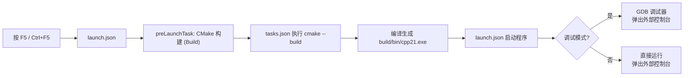

# `.vscode/` 配置文件说明

本文档解释了 `cpp21` CMake 工程中 `.vscode/` 目录下三个配置文件的作用与关键字段。

---

## 1. `settings.json` — 工作区设置

当前内容已被注释（全量禁用），原始配置如下：

```json
{
    "cmake.configureOnOpen": true,
    "cmake.buildDirectory": "${workspaceFolder}/build",
    "files.associations": {
        "*.cpp": "cpp",
        "*.hpp": "cpp",
        "*.h": "c"
    },
    "C_Cpp.default.configurationProvider": "ms-vscode.cmake-tools"
}
```

| 字段 | 作用 |
|------|------|
| `cmake.configureOnOpen` | 打开工程时自动运行 CMake 配置（相当于 `cmake -B build`），无需手动触发 |
| `cmake.buildDirectory` | 指定 CMake 构建输出目录为 `${workspaceFolder}/build`，与 `CMakeLists.txt` 中 `CMAKE_BINARY_DIR` 一致 |
| `files.associations` | 将 `.cpp` / `.hpp` 关联为 C++ 文件，`.h` 关联为 C 文件，确保语法高亮和 IntelliSense 正确工作 |
| `C_Cpp.default.configurationProvider` | 让 **CMake Tools** 扩展接管 C/C++ IntelliSense 配置，自动解析头文件路径、编译选项、宏定义等，避免手动配置 `c_cpp_properties.json` |

---

## 2. `tasks.json` — 构建任务

```json
{
    "tasks": [
        {
            "type": "shell",
            "label": "CMake 构建 (Build)",
            "command": "cmake",
            "args": ["--build", "build", "--config", "Debug"],
            "options": { "cwd": "${workspaceFolder}" },
            "problemMatcher": ["$gcc"],
            "group": { "kind": "build", "isDefault": true },
            "detail": "CMake 编译工程"
        }
    ],
    "version": "2.0.0"
}
```

| 字段 | 值 | 说明 |
|------|-----|------|
| `type` | `"shell"` | 作为 shell 命令在终端中执行 |
| `label` | `"CMake 构建 (Build)"` | 任务名称，在命令面板和 `launch.json` 的 `preLaunchTask` 中引用 |
| `command` | `"cmake"` | 调用 CMake 命令行工具 |
| `args` | `--build build --config Debug` | 等价于终端执行 `cmake --build build --config Debug`，编译 Debug 版本 |
| `options.cwd` | `${workspaceFolder}` | 工作目录设为工程根目录 |
| `problemMatcher` | `["$gcc"]` | 使用 GCC 错误格式匹配器，编译错误会自动出现在 VS Code **问题** 面板中，点击可跳转到对应代码行 |
| `group.kind` | `"build"` | 标记为构建类任务 |
| `group.isDefault` | `true` | 设为**默认构建任务**，按 <kbd>Ctrl+Shift+B</kbd> 直接触发 |

> **用法**：<kbd>Ctrl+Shift+B</kbd> 一键编译整个工程。

---

## 3. `launch.json` — 调试与运行配置

```json
{
    "configurations": [
        {
            "name": "调试 (Debug) - F5",
            "type": "cppdbg",
            "request": "launch",
            "program": "${command:cmake.launchTargetPath}",
            "stopAtEntry": false,
            "cwd": "${workspaceFolder}",
            "externalConsole": true,
            "MIMode": "gdb",
            "miDebuggerPath": "C:\\MinGW\\bin\\gdb.exe",
            "setupCommands": [
                { "text": "-enable-pretty-printing", "ignoreFailures": true }
            ],
            "preLaunchTask": "CMake 构建 (Build)"
        },
        {
            "name": "运行 (Run) - Ctrl+F5",
            "type": "cppdbg",
            "request": "launch",
            "program": "${command:cmake.launchTargetPath}",
            "stopAtEntry": false,
            "cwd": "${workspaceFolder}",
            "externalConsole": true,
            "preLaunchTask": "CMake 构建 (Build)"
        }
    ]
}
```

### 通用字段（两个配置共享）

| 字段 | 值 | 说明 |
|------|-----|------|
| `type` | `"cppdbg"` | 使用 VS Code 内置的 C++ 调试器 |
| `request` | `"launch"` | 启动模式（而非附加到已有进程） |
| `program` | `${command:cmake.launchTargetPath}` | 动态获取 CMake 构建生成的可执行文件路径（`build/bin/cpp21.exe`），无需硬编码 |
| `stopAtEntry` | `false` | 不在 `main()` 入口自动暂停，直接运行到第一个断点 |
| `cwd` | `${workspaceFolder}` | 程序运行时的工作目录 |
| `externalConsole` | `true` | 弹出独立的 Windows 控制台窗口，确保 `std::cout` 输出正常显示 |
| `preLaunchTask` | `"CMake 构建 (Build)"` | 启动前自动执行构建任务，确保运行的是最新代码 |

### 调试配置独有的字段

| 字段 | 值 | 说明 |
|------|-----|------|
| `MIMode` | `"gdb"` | 使用 GDB 作为底层调试器（Machine Interface 模式） |
| `miDebuggerPath` | `C:\MinGW\bin\gdb.exe` | GDB 调试器的绝对路径，与 MinGW GCC 配套 |
| `setupCommands` | `-enable-pretty-printing` | 启用 GDB 的 STL 容器美化打印，调试时可以直观看到 `std::string`、`std::vector` 等内容 |

> 运行配置**不包含** GDB 相关字段，因此不会挂载调试器，程序直接运行，速度更快。

### 两个配置的对比

| 场景 | 名称 | 快捷键 | 挂调试器 | 适用 |
|------|------|:--:|:--:|------|
| **调试** | 调试 (Debug) - F5 | <kbd>F5</kbd> | ✅ GDB | 设置断点、单步执行、查看变量、分析崩溃 |
| **运行** | 运行 (Run) - Ctrl+F5 | <kbd>Ctrl+F5</kbd> | ❌ 无 | 快速查看程序运行结果 |

---

## 三者协作流程



**总结：**

- `settings.json` → 配置编辑器行为和 CMake Tools 扩展
- `tasks.json` → 定义如何**编译**代码
- `launch.json` → 定义如何**运行/调试**编译产物
