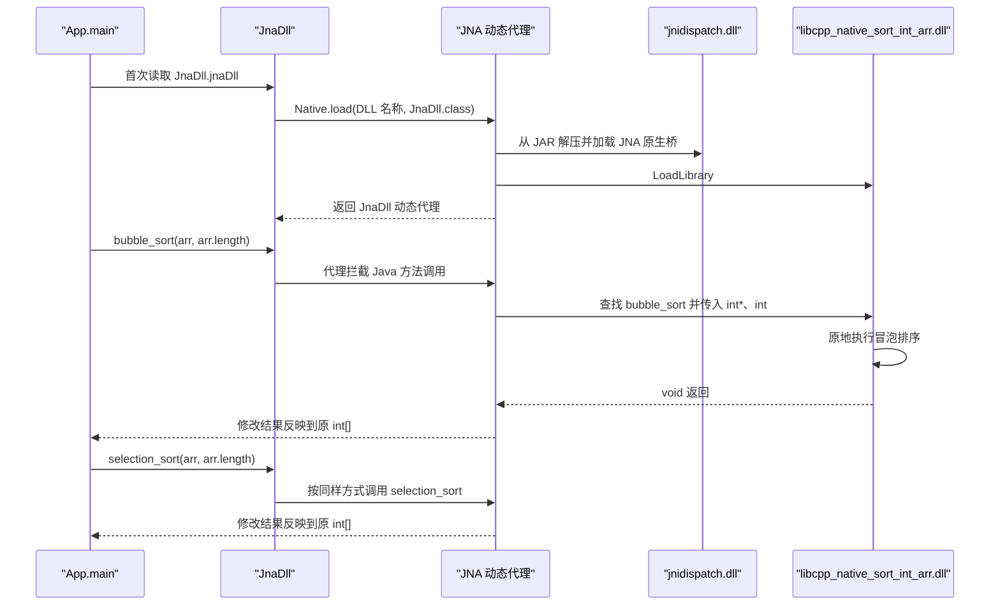

# `java_native_access` 项目 JNA 调用流程

## 1. 项目结论

这个项目演示了 Java 通过 JNA 调用 C++ 动态库中的两个排序函数。完整调用链是：

```text
App.main
  -> JnaDll 接口中的 JNA 动态代理
  -> JNA 自带的 jnidispatch.dll
  -> Windows 加载 libcpp_native_sort_int_arr.dll
  -> 查找并调用 bubble_sort / selection_sort
  -> C++ 原地修改整数数组
  -> 修改结果回写到 Java int[]
  -> App 打印排序结果
```

它和传统 JNI 示例的主要区别是：项目不需要生成 JNI 头文件，也不需要编写 `Java_包名_类名_方法名` 形式的桥接函数。Java 只需声明一个与原生函数匹配的 JNA 接口，JNA 在运行时完成动态库加载、符号查找、参数转换和函数调用。

项目包含两个相互独立的构建根：

- `cpp_native`：使用 CMake 和 MinGW 构建 C++ DLL。
- `java_call_cpp`：使用 Maven 编译 Java、引入 JNA，并生成可执行 fat JAR。

## 2. 关键文件与职责

| 文件 | 职责 |
| --- | --- |
| [`cpp_native/src/sort_int_arr.h`](cpp_native/src/sort_int_arr.h) | 声明 `bubble_sort` 和 `selection_sort`，用 `extern "C"` 保持 C 符号名。 |
| [`cpp_native/src/sort_int_arr.cpp`](cpp_native/src/sort_int_arr.cpp) | 实现两个原地排序函数。 |
| [`cpp_native/CMakeLists.txt`](cpp_native/CMakeLists.txt) | 创建 `cpp_native_sort_int_arr` 共享库目标。 |
| [`cpp_native/CMakePresets.json`](cpp_native/CMakePresets.json) | 配置 MinGW、Debug 构建目录和构建预设。 |
| [`java_call_cpp/src/main/java/com/JnaDll.java`](java_call_cpp/src/main/java/com/JnaDll.java) | 定义 Java 与原生函数之间的 JNA 映射，并加载 DLL。 |
| [`java_call_cpp/src/main/java/com/App.java`](java_call_cpp/src/main/java/com/App.java) | Java 入口；创建数组、调用两个原生排序函数并打印结果。 |
| [`java_call_cpp/pom.xml`](java_call_cpp/pom.xml) | 引入 JNA、设置 `com.App` 入口、复制 DLL，并生成 fat JAR。 |

## 3. 构建与产物流转

### 3.1 C++ 动态库

`CMakeLists.txt` 使用 `add_library(... SHARED ...)` 创建共享库目标：

```text
cpp_native_sort_int_arr
```

MinGW 构建后的主要产物是：

```text
cpp_native/build/mingw/libcpp_native_sort_int_arr.dll
cpp_native/build/mingw/libcpp_native_sort_int_arr.dll.a
```

其中 `.dll` 是运行时动态库，`.dll.a` 是供原生链接器使用的导入库；本项目的 JNA 调用只需要 `.dll`。

头文件中的 `extern "C"` 阻止 C++ 名字改编，因此 DLL 中可以找到与 Java 方法同名的导出符号：

```text
bubble_sort
selection_sort
```

本次已经从现有 DLL 导出表中确认这两个符号。需要区分两个概念：

- `extern "C"` 负责保持符号名，避免 C++ 名字改编。
- `__declspec(dllexport)` 或链接器配置负责把符号导出到 DLL。

当前源码没有实际使用 `__declspec(dllexport)`；`CPP_NATIVE_EXPORTS` 即便作为编译定义存在，也没有被头文件消费。因此当前构建依赖 MinGW 的导出行为，切换到 MSVC 时应补充有效的显式导出宏。

### 3.2 DLL 进入 Java 模块

CMake 构建结束后，需要先手动复制 DLL：

```text
cpp_native/build/mingw/libcpp_native_sort_int_arr.dll
  -> java_call_cpp/libcpp_native_sort_int_arr.dll
```

这是 CMake 与 Maven 两个构建根之间的桥接步骤，当前没有被 CMake 或 Maven 自动完成。

执行 `mvn package` 时，`maven-resources-plugin` 在 `prepare-package` 阶段继续复制 DLL：

```text
java_call_cpp/libcpp_native_sort_int_arr.dll
  -> java_call_cpp/target/libcpp_native_sort_int_arr.dll
```

同时，`maven-assembly-plugin` 生成：

```text
java_call_cpp/target/java_call_cpp-1.0-SNAPSHOT-jar-with-dependencies.jar
```

fat JAR 内包含项目类、JNA Java 类以及 JNA 自带的各平台 `jnidispatch` 库，但项目自己的 `libcpp_native_sort_int_arr.dll` 没有嵌入 JAR，仍然是外部 sidecar 文件。

普通的 `java_call_cpp-1.0-SNAPSHOT.jar` 只包含项目代码，不包含 JNA 依赖，不能直接作为独立程序运行；完整运行应使用 `jar-with-dependencies` 产物。

## 4. Java 到 C++ 的运行时调用流程



### 4.1 初始化 JNA 接口

`JnaDll` 继承 `com.sun.jna.Library`：

```java
public interface JnaDll extends Library {
    JnaDll jnaDll =
        (JnaDll) Native.load("libcpp_native_sort_int_arr.dll", JnaDll.class);
}
```

接口字段隐式为 `public static final`。当 `App` 第一次读取 `JnaDll.jnaDll` 时，JVM 初始化该接口并执行 `Native.load(...)`。

`Native.load(...)` 创建 `Library.Handler`，由它加载 DLL，然后通过 `Proxy.newProxyInstance(...)` 返回一个实现 `JnaDll` 的运行时动态代理。第一次调用某个接口方法时，代理按 Java 方法名取得对应的原生 `Function` 并执行。

### 4.2 加载 JNA 自身的原生桥

JNA 的 Java 代码不能直接执行任意 DLL 函数。第一次初始化 `com.sun.jna.Native` 时，JNA 会从依赖 JAR 中找到与当前系统和 CPU 架构匹配的 `jnidispatch.dll`，将它解压到临时目录并加载。

这个 DLL 是 JNA 自己的底层桥接层，不是本项目编写的 DLL。它负责把 Java 侧的动态调用转换为操作系统原生函数调用。

### 4.3 加载项目 DLL

JNA 随后按 `JnaDll.java` 中的名称查找：

```text
libcpp_native_sort_int_arr.dll
```

当前代码传入的是相对文件名，因此运行时必须满足下列条件之一：

- 当前工作目录中存在该 DLL；
- 通过 `-Djna.library.path=目录` 指定 DLL 搜索目录；
- DLL 位于操作系统可搜索的路径中。

项目将 DLL 复制到 `target` 后，可以先进入 `target` 再启动 JAR，也可以显式把 `target` 设置为 `jna.library.path`。仅仅让 DLL 与 JAR 位于同一目录，并不等于 JNA 会自动按 JAR 所在目录查找；进程工作目录和显式搜索路径才是关键。

### 4.4 Java 与 C/C++ 签名映射

Java 接口：

```java
void bubble_sort(int[] values, int length);
void selection_sort(int[] values, int length);
```

C/C++ 声明：

```cpp
void bubble_sort(int* values, int length);
void selection_sort(int* values, int length);
```

映射关系如下：

| Java/JNA | C/C++ | 说明 |
| --- | --- | --- |
| `void` | `void` | 原生函数没有返回值。 |
| `int` | `int` | 在当前 Windows/MinGW ABI 中，两侧都是 32 位有符号整数。 |
| `int[]` | `int*` | JNA 让原生函数访问数组元素；调用完成后，修改反映到原 Java 数组。 |
| Java 方法名 | DLL 导出符号名 | 未配置 `FunctionMapper` 时，JNA 按同名符号查找。 |
| `Library` 默认调用约定 | C 默认调用约定 | 与当前 MinGW 导出函数匹配。 |

JNA 底层可以固定 Java 数组，也可以使用临时本机缓冲区；这个细节由 JVM/JNA 原生桥决定。对本项目而言，已经通过实际运行确认 C++ 的修改会反映到原来的 `int[]`。

### 4.5 执行排序并回写数组

`App` 把 `arr.length` 作为第二个参数传给 C++。C++ 直接通过 `int*` 原地交换数组元素，函数返回后，`App` 可以从原来的 Java 数组中看到新顺序，所以不需要接收返回值。

当前 C++ 函数不检查空指针或长度上界。现有调用始终传入非空数组和 `arr.length`，是安全的；新增调用方也必须保证 `0 <= length <= values.length`。原生函数不能保存本次调用获得的 `int*`，该指针只在这次 JNA 调用期间有效。

## 5. 完整构建与运行命令

以下命令按 Windows Git Bash / MSYS2 Bash 格式编写。

```bash
set -euo pipefail

cd /c/source/learning_cpp_vscode/java_native_access/cpp_native

# 普通 Git Bash 未配置 MinGW 时，先补充工具链路径。
export PATH="/c/msys64/ucrt64/bin:$PATH"

# 配置并构建 C++ DLL。
cmake --preset mingw
cmake --build --preset mingwbuild

# 把最新 DLL 交给 Java 模块。
test -f build/mingw/libcpp_native_sort_int_arr.dll
cp build/mingw/libcpp_native_sort_int_arr.dll \
   ../java_call_cpp/libcpp_native_sort_int_arr.dll

# 编译 Java、复制 DLL，并生成 fat JAR。
cd ../java_call_cpp
mvn clean package

# 显式指定 Maven target 为 JNA 的 DLL 搜索目录。
test -f target/libcpp_native_sort_int_arr.dll
java -Djna.library.path=target \
     -jar target/java_call_cpp-1.0-SNAPSHOT-jar-with-dependencies.jar
```

预期输出：

```text
Hello World!
[-1, 1, 2, 5, 6, 8, 9]
[-1, 1, 2, 5, 6, 8, 9]
```

也可以进入 `target` 后运行：

```bash
cd /c/source/learning_cpp_vscode/java_native_access/java_call_cpp/target
java -Djna.library.path=. \
     -jar java_call_cpp-1.0-SNAPSHOT-jar-with-dependencies.jar
```

## 6. 调试 DLL 加载过程

JNA 支持输出动态库查找日志：

```bash
cd /c/source/learning_cpp_vscode/java_native_access/java_call_cpp
java -Djna.debug_load=true \
     -Djna.library.path=target \
     -jar target/java_call_cpp-1.0-SNAPSHOT-jar-with-dependencies.jar
```

关键日志应包含：

```text
Looking for library 'libcpp_native_sort_int_arr.dll'
Trying libcpp_native_sort_int_arr.dll
Found library 'libcpp_native_sort_int_arr.dll'
```

如果默认临时目录不可写，可显式设置 JNA 解压目录：

```bash
cd /c/source/learning_cpp_vscode/java_native_access/java_call_cpp
mkdir -p target/jna-tmp
java -Djna.tmpdir="$PWD/target/jna-tmp" \
     -Djna.debug_load=true \
     -Djna.library.path=target \
     -jar target/java_call_cpp-1.0-SNAPSHOT-jar-with-dependencies.jar
```

## 7. 常见失败点

| 现象 | 调用链中的失败位置 | 检查项 |
| --- | --- | --- |
| `UnsatisfiedLinkError: Unable to load library` | JNA 加载项目 DLL | 当前工作目录、`jna.library.path`、DLL 是否已复制、DLL 的间接依赖是否齐全。 |
| `Failed to create temporary file ... jnidispatch.dll` | JNA 初始化自身原生桥 | 临时目录权限；必要时设置 `-Djna.tmpdir`。 |
| 找不到 `bubble_sort` 或 `selection_sort` | JNA 查找导出函数 | `extern "C"`、实际导出表、方法名拼写、调用约定。 |
| `NoClassDefFoundError: com/sun/jna/Library` | JVM 加载 Java 依赖 | 误运行了普通 JAR；改用 `jar-with-dependencies`。 |
| DLL 架构不匹配错误 | Windows 加载 DLL | JVM、JNA 与 DLL 的 x86/x64 架构必须一致。 |
| Java 数组结果错误或进程崩溃 | 参数封送或 C++ 数组访问 | Java/C 类型是否匹配，`length` 是否越界，是否传入空数组。 |
| 修改 C++ 后仍运行旧逻辑 | CMake 与 Maven 之间的手动桥接 | 重新构建 DLL，并再次复制到 `java_call_cpp` 后再打包。 |

可用 MinGW 工具确认导出符号：

```bash
cd /c/source/learning_cpp_vscode/java_native_access/cpp_native
nm -g --defined-only build/mingw/libcpp_native_sort_int_arr.dll \
  | grep -E 'bubble_sort|selection_sort'
```

## 8. 当前实现边界

- 当前实现面向 Windows，Java 代码硬编码了 `.dll` 文件名。
- `jna-platform` 已在 POM 中声明，但这两个函数调用只使用了核心 `jna` 依赖。
- `java_call_cpp/README.MD` 中的手动下载 JNA JAR 说明不参与当前 Maven 构建；实际依赖来自 POM。
- fat JAR 包含 JNA 自身的 `jnidispatch.dll`，但不包含项目的 C++ DLL。
- `cpp_native/REAEME.MD` 仍描述旧的 JNI `hello.dll` 示例，不能作为当前 JNA 构建链的准确说明。
- `CMakePresets.json` 的显示名仍写着 `GCC 9.2.0`，但本次实际解析到的是 g++ 16.1.0；显示名只是标签。
- Maven 当前没有测试源码；`mvn clean package` 会执行测试阶段，但结果是 `No tests to run`。

## 9. 本次验证结果

验证日期：2026-07-29。

- `cmake --preset mingw`：配置成功。
- `cmake --build --preset mingwbuild --verbose`：目标 `cpp_native_sort_int_arr` 构建成功。
- DLL 导出表：确认存在 `bubble_sort` 和 `selection_sort`，DLL 为 x86-64。
- `mvn clean package`：构建成功，生成普通 JAR、fat JAR 和 `target` 下的 DLL。
- fat JAR 内容：确认包含 `com.App`、`com.JnaDll`、JNA 类和 Windows `jnidispatch.dll`；确认未嵌入项目 DLL。
- Java 端到端运行：两个原生排序调用均得到 `[-1, 1, 2, 5, 6, 8, 9]`。
- 验证环境：Java 21.0.2、Maven 3.9.6、CMake 3.26.3、MinGW g++ 16.1.0，均为 64 位 Windows 环境。
