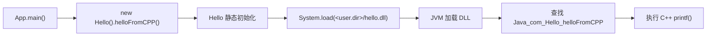

# Java 通过 JNI 调用 C++ DLL：关键流程总结

## 1. 项目目标

本项目演示了 Windows 下最基本的 JNI 调用链：

```text
Java 声明 native 方法
    → javac 生成 JNI 头文件
    → C++ 按头文件实现导出函数
    → CMake 将 C++ 编译为 DLL
    → Java 加载 DLL 并调用其中的函数
```

JNI 的核心作用是建立两端共同遵守的二进制接口：Java 端的方法声明决定接口，`javac -h` 生成 C/C++ 函数签名，DLL 必须导出完全匹配的函数，JVM 才能完成绑定。

## 2. 项目中的关键文件

| 文件 | 作用 |
| --- | --- |
| `java_call_cpp/src/main/java/com/App.java` | Java 程序入口，调用 `Hello.helloFromCPP()` |
| `java_call_cpp/src/main/java/com/Hello.java` | 声明 native 方法，并通过 `System.load()` 加载 DLL |
| `java_call_cpp/src/main/java/com/com_Hello.h` | `javac -h` 生成的 JNI 头文件副本 |
| `cpp_native/src/com_Hello.h` | C++ 工程使用的 JNI 头文件 |
| `cpp_native/src/com_Hello.cpp` | JNI 函数的 C++ 实现 |
| `cpp_native/CMakeLists.txt` | 查找 JNI 头文件并构建动态库 |
| `cpp_native/CMakePresets.json` | MinGW 配置和构建预设 |

## 3. 完整调用链



实际运行顺序如下：

1. JVM 进入 `com.App.main()`。
2. `new Hello()` 首次使用 `Hello` 类，触发其静态初始化块。
3. 静态初始化块加载当前工作目录中的 `hello.dll`。
4. Java 调用 `helloFromCPP()`。
5. JVM 在 DLL 中查找与该方法匹配的 JNI 导出符号。
6. JVM 进入 C++ 实现并输出 `im from cpp`。

## 4. Java 端声明 native 方法

`Hello.java` 中的关键代码为：

```java
package com;

public class Hello {

    public native void helloFromCPP();

    static {
        System.out.println(System.getProperty("user.dir") + "/" + "hello.dll");
        System.load(System.getProperty("user.dir") + "/" + "hello.dll");
    }
}
```

关键点：

- `native` 表示该方法只有 Java 声明，具体实现位于本地动态库中。
- 当前方法是实例方法，没有业务参数，返回值为 `void`，JNI 描述符是 `()V`。
- 项目使用 `System.load(绝对路径)`，不是 `System.loadLibrary("hello")`。
- DLL 路径由 `user.dir` 决定，因此程序应从 `java_call_cpp` 目录启动，且该目录下必须存在名为 `hello.dll` 的文件。

`App.java` 发起实际调用：

```java
new Hello().helloFromCPP();
```

## 5. 生成 JNI 头文件

在 `java_call_cpp` 目录中执行：

```powershell
$utf8 = [System.Text.UTF8Encoding]::new($false)
$OutputEncoding = $utf8
[Console]::InputEncoding = $utf8
[Console]::OutputEncoding = $utf8

New-Item -ItemType Directory -Force .\target\jni-classes | Out-Null

javac -encoding UTF-8 `
    -h .\src\main\java\com `
    -d .\target\jni-classes `
    .\src\main\java\com\Hello.java

Copy-Item `
    .\src\main\java\com\com_Hello.h `
    ..\cpp_native\src\com_Hello.h `
    -Force
```

`-h` 指定 JNI 头文件的输出目录，`-d` 将临时生成的 `.class` 文件放入 `target`，避免污染源码目录。

生成的核心声明为：

```cpp
JNIEXPORT void JNICALL Java_com_Hello_helloFromCPP
  (JNIEnv *, jobject);
```

函数名来自 Java 的包名、类名和方法名：

```text
Java_ + com + Hello + helloFromCPP
= Java_com_Hello_helloFromCPP
```

这里使用的是 Java 包名 `com`，与 Maven 的 `groupId` `com.example` 无关。

两个由 JVM 自动传入的参数分别是：

- `JNIEnv *`：JNI 环境指针，用于字符串转换、对象访问、异常处理等 JNI 操作。
- `jobject`：调用该非静态 native 方法的当前 `Hello` 对象；如果 Java 方法是 `static native`，这里会改为 `jclass`。

生成文件中的 `extern "C"` 用于关闭 C++ 名字改编，`JNIEXPORT` 负责导出符号，`JNICALL` 指定 JNI 调用约定。带有 `DO NOT EDIT THIS FILE` 标记的头文件不应手工修改。

## 6. C++ 实现 JNI 函数

`cpp_native/src/com_Hello.cpp` 按生成的声明实现函数：

```cpp
#include <jni.h>
#include <stdio.h>
#include "com_Hello.h"

JNIEXPORT void JNICALL Java_com_Hello_helloFromCPP
  (JNIEnv *, jobject) {

    printf("%s\n", "im from cpp");
}
```

C++ 函数名、返回值、参数顺序和调用约定必须与生成的头文件完全一致。本例没有 Java 业务参数和返回值，因此不涉及 `jstring`、`jint` 等类型转换。

## 7. 使用 CMake 构建 DLL

`CMakeLists.txt` 的核心配置是：

```cmake
add_library(hello SHARED
    src/com_Hello.cpp
)

find_package(JNI REQUIRED)

target_include_directories(hello PRIVATE
    ${JNI_INCLUDE_DIRS}
)
```

- `add_library(hello SHARED ...)` 创建动态库目标。
- `find_package(JNI REQUIRED)` 根据 JDK 环境查找 `jni.h` 和 Windows 平台的 `jni_md.h`。
- `JAVA_HOME` 应指向有效的 JDK，Java 与 DLL 的体系结构必须一致，例如都为 x64。
- 本例的 DLL 由 JVM 加载，C++ 代码也没有主动创建 JVM，因此当前实现只需要 JNI 头文件，不需要显式链接 `jvm.lib`。

项目提供了 MinGW 预设。正常情况下可在 `cpp_native` 目录执行：

```powershell
cmake --preset mingw
cmake --build --preset mingwbuild
```

MinGW 构建的实际 DLL 名称是：

```text
cpp_native/build/mingw/libhello.dll
```

如果项目目录曾被移动或重命名，旧的 `CMakeCache.txt` 会记录失效的绝对路径。此时可使用一个新的构建目录重新配置：

```powershell
cmake --preset mingw -B .\build\jni
cmake --build .\build\jni
```

对应产物为 `cpp_native/build/jni/libhello.dll`。

## 8. 将 DLL 交给 Java

MinGW/CMake 生成的是 `libhello.dll`，但当前 Java 代码固定加载 `hello.dll`，所以必须复制并改名。

使用默认预设构建目录时，在 `cpp_native` 目录执行：

```powershell
Copy-Item `
    .\build\mingw\libhello.dll `
    ..\java_call_cpp\hello.dll `
    -Force
```

如果使用了上面的新构建目录，则源文件改为 `.\build\jni\libhello.dll`。

`libhello.dll.a` 是供其他原生程序链接 DLL 时使用的导入库，Java 运行本例不需要它。项目的 Git 忽略规则也不会提交 DLL，因此新环境需要重新构建并执行复制步骤。

## 9. 编译并运行 Java

在 `java_call_cpp` 目录执行：

```powershell
mvn compile
java -cp .\target\classes com.App
```

不能直接使用 `java -jar`，因为当前 POM 没有为 JAR 配置 `Main-Class`。

成功输出为：

```text
Hello World!
C:\source\learning_cpp_vscode\java_native_interface\java_call_cpp/hello.dll
im from cpp
```

最后一行来自 C++ DLL，说明以下环节均已成功：

1. Java 找到并加载 DLL。
2. JVM 找到正确的 JNI 导出符号。
3. Java 调用已经进入 C++ 实现。

## 10. 修改接口时必须同步的内容

只要修改以下任一内容，就必须重新执行 `javac -h`、同步头文件、重新构建 DLL：

- Java 包名；
- Java 类名；
- native 方法名；
- 方法是否为 `static`；
- 参数类型或数量；
- 返回值类型；
- native 方法是否重载。

正确的依赖方向是：

```text
Hello.java 中的 native 声明
    → javac -h 重新生成 com_Hello.h
    → C++ 按新头文件修改实现
    → 重新构建并复制 DLL
    → 重新运行 Java
```

不要通过手工修改生成的头文件来反向改变 Java 接口。

## 11. 常见失败位置

| 现象 | 重点检查 |
| --- | --- |
| CMake 找不到 JNI | `JAVA_HOME` 是否指向完整 JDK，而不是 JRE；重新配置 CMake |
| `Can't load ... hello.dll` | 启动工作目录是否为 `java_call_cpp`，DLL 是否已复制为 `hello.dll` |
| `UnsatisfiedLinkError`，提示找不到 native 方法 | Java 声明、生成头文件、C++ 导出函数和 DLL 是否为同一版本 |
| DLL 存在但仍无法加载 | Java 与 DLL 位数是否一致，DLL 依赖的运行库是否可被 Windows 找到 |
| CMake 提示源码目录与缓存目录不一致 | 项目目录曾移动；使用新的构建目录重新配置 |
| 修改 Java 接口后仍执行旧逻辑 | 重新生成头文件、重建 DLL，并覆盖 `java_call_cpp/hello.dll` |

